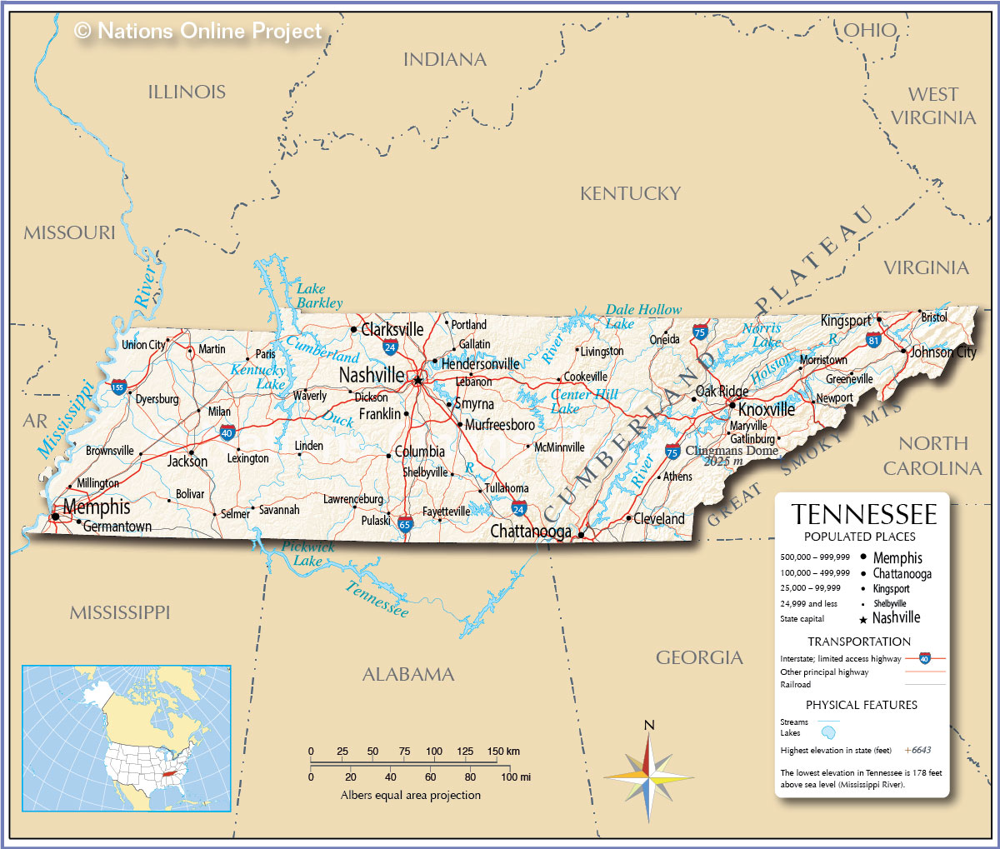

## Student Project for Computer Information Technology Applied Systems Development
## Pellissippi State Community College (PSTCC) Knoxville, Tennessee 
## In Cooperation with Knoxville Utility Board (KUB)
#### KUB as Client for the Student Team
KUB delivers electric power, water, and natural gas to some half a million customers in five counties in the Knoxville area. PSTCC conducts this class to give students real-world experience working with a client. This class is only possible with the generous support of organizations that volunteer as clients.   
Student Team: Amber Rivera Michal Kaminski, Donald Nash, and Maude Volk  
KUB Team: DeWayne Lane, Keith Clinard, and Zachary Berardo

