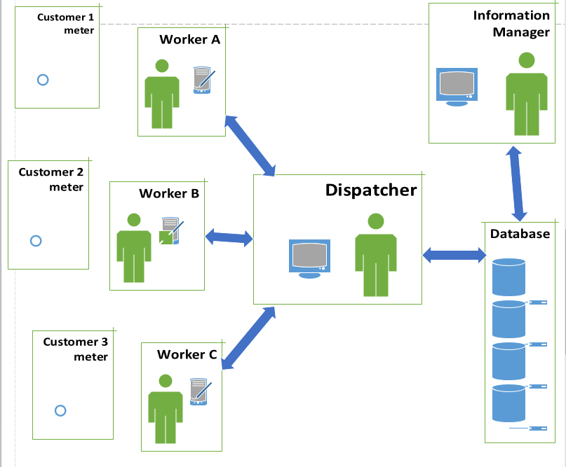

## KUB
### Currently
KUB has a system for a dispatcher to receive jobs that need to be done. This field work consists of jobs like starting a customer's utility service, reading a meter, restoring power, fixing a water leak, or inspecting a gas line.	The dispatcher has a list of field technicians to assign these jobs. Sometimes a job is cancelled, in that case the dispatcher wants to be able to communicate this right away. The field technician has a mobile device that receives dispatches and updates the dispatcher on job status.
### Plans
KUB is in the process of switching out all of their electric meters. They want to include before and after photos of this to ensure correct meter reading at the time of the switch. The problem is the slowness of the system and the bulkiness of the storage. KUB wants to store data in the cloud to improve the speed of communication and to have all devices update whenever information in the database changes.

