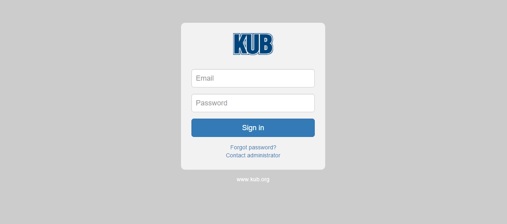

# An Example
## Using the login page
Login parts:
login.html
app/components/login-form/template.hbs
app/components/login-form/component.js
app/login/template.hbs
app/login/route.js

The look of the form was developed by Michal using HTML while Amber worked on making the login worked.

### The look and its code

### login.html
<!--
<head>
<title>KUB Login Form</title>
<meta charset="utf-8">
<meta name="viewport" content="width=device-width, initial-scale=1">
</head>

<body>
  

    

      

      

        <section class="login-form">
          <form method="post" action="#" role="login">
            
            <input type="email" name="email" placeholder="Email" required class="form-control input-lg"  />

            <!-- Amber div tag -->
            
 

            <input type="password" class="form-control input-lg"  placeholder="Password" required="" />

            

            <button type="submit" name="go" class="btn btn-lg btn-primary btn-block">Sign in</button>
            

              <a href="#">Forgot password ?</a>
            

            

              <a href="#">Contact administrator</a>
            

          </form>

          

            <a href="#">www.kub.com</a>
          

        </section>
        

        

    

  

</body>
-->
### app/components/login-form/template.hbs

  

    

    

      <section class="login-form">
        <form method="post" action="#" role="login">
          
          <!-- Amber div tag -->
          
 

          {{input type="email" value = userEmail placeholder="Email" required=true class="form-control input-lg"  }}

          {{input type="password" value = userPassword class="form-control input-lg"  placeholder="Password" required="star symbol" }}

          

          <button {{action 'login'}} class="btn btn-lg btn-primary btn-block">Sign in</button>
          

            <a href="#">Forgot password?</a>
          

           
          

            <a href="#">Contact administrator</a>
          

        </form>

        

          <a href="https://www.kub.org">www.kub.org</a>
        

      </section>
      

      

  

### app/components/login-form/component.js

import Ember from 'ember';

export default Ember.Component.extend({

    actions: {
      login() {

        this.sendAction('login', this.get('userEmail'), this.get('userPassword'));

      },

      forgotPassword() {
        this.sendAction('forgotPassword');
      }
    }
});
### app/login/template.hbs
{{login-form login="login" forgotPassword="forgotPassword"}}
### app/login/route.js
import Ember from 'ember';

export default Ember.Route.extend({

  redirect() {
    if (this.get('session.isAuthenticated')) {
      this.transitionTo('protected');
    }
  },

  actions: {

    login(email, password) {
      let session = this.get('session');
      session.open('firebase', {
        provider: 'password',
        email,
        password

      }).then(() => {

        let user = session.content.currentUser;
        let email = user.email;
        let username = email.substring(0, email.indexOf('@'));
        user.username = username;
        this.set('currentUser.content', user);
        this.transitionTo('protected');

      });
    },

    forgotPassword() {
      this.transitionTo('password-reset');
    }
  }

});
