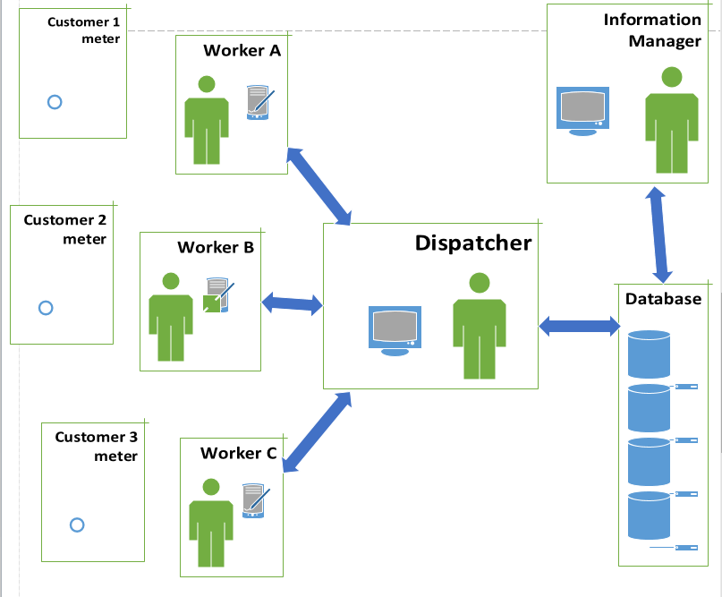

## KUB
### Current System Architecture
KUB has a system for a dispatcher to receive jobs that need to be done. This field work consists of jobs like starting a customer's utility service, reading a meter, restoring power, fixing a water leak, or inspecting a gas line.	The dispatcher has a list of field technicians to assign these jobs. Sometimes a job is cancelled, in that case the dispatcher wants to be able to communicate this right away. The field technician has a mobile device that receives dispatches and updates the dispatcher on job status.

### New System Architecture
* Fieldwork-manager
  * Hosted on Heroku for testing purposes - It loads the Firebase database. It will not be used in final production.
* Fieldwork-dispatcher
  * Sees jobs as they are loaded into the Firebase database
  * Sees which workers are available
* Fieldwork-worker
  * Sees assignments as filtered for that worker -
  * job status: acknowledged, enroute, arrived, completed sent to the database where it displays on all authorized screens

                          Diagram by Amber Rivera
